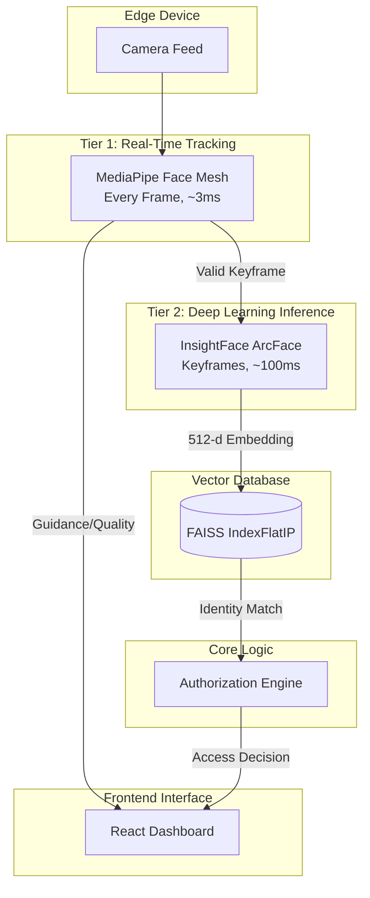
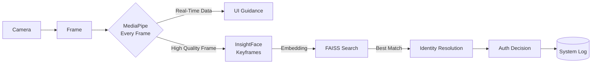
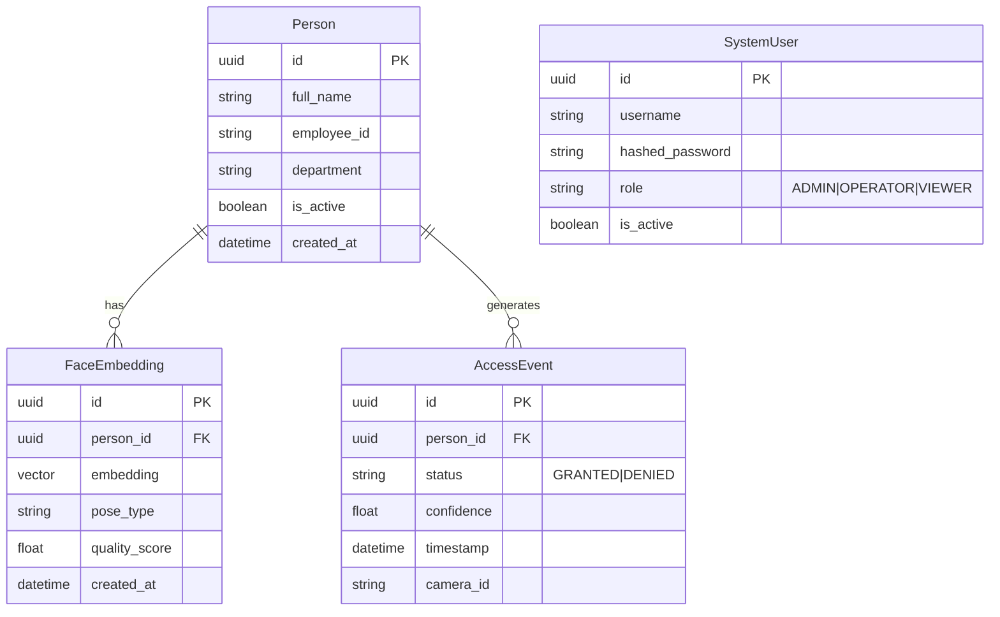
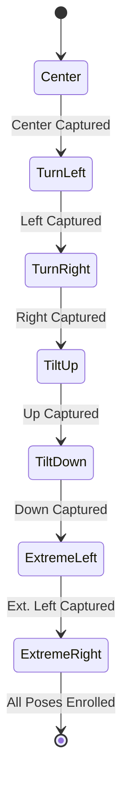

# FaceVault 360

> **Recognize. Verify. Protect.**


FaceVault 360 is a production-quality facial recognition and access-control system designed for high accuracy and performance. It utilizes a state-of-the-art hybrid computer vision pipeline to provide real-time facial recognition, liveness detection, and fail-closed access authorization.

## Features

### Advanced Recognition & Capture
*   **Multi-Angle Enrollment:** Robust 7-pose capture process ensures high accuracy across various facial angles.
*   **Pose-Aware Recognition:** Accurately identifies individuals regardless of their face orientation relative to the camera.
*   **Headwear Tolerance:** Maintains recognition accuracy even when individuals wear hats or glasses.
*   **Side-Face Recognition:** Capable of recognizing individuals from profile angles.

### Real-Time Interaction & Quality
*   **Real-Time Camera Guidance:** Provides immediate feedback ("LOOK INTO CAMERA", "TURN LEFT") to optimize capture quality.
*   **Face Quality Assessment:** Evaluates lighting, blur, and occlusion to ensure only high-quality frames are processed.
*   **Liveness Detection:** Incorporates anti-spoofing measures to detect and prevent unauthorized access attempts using photos or screens.

### Security & Access Control
*   **Access Authorization:** Fail-closed design ensures access is denied by default unless explicitly verified and authorized.
*   **Entry & Testing Modes:** Distinct operational modes for active access control and system calibration/testing.
*   **Privacy-Conscious Design:** Emphasizes data protection by storing mathematical embeddings rather than raw images, with complete deletion capabilities.

### Management & Analytics
*   **Real-Time Dashboard:** A responsive, modern interface for monitoring access events and system status.
*   **Analytics & Logging:** Comprehensive logging and visualization of access trends, anomalies, and system health.

---

## Architecture

### System Architecture



### Recognition Pipeline



### Database ER Diagram



### Enrollment Workflow



---

## Technology Stack

| Component | Technology | Purpose |
|---|---|---|
| **Face Tracking** | MediaPipe Face Mesh | Real-time landmarks, pose estimation, blink detection |
| **Face Recognition** | InsightFace (ArcFace) | Generating highly accurate 512-d face embeddings |
| **Vector Search** | FAISS | Fast, efficient cosine similarity matching for embeddings |
| **Backend** | FastAPI + SQLAlchemy 2.0 | High-performance REST API and WebSocket communication |
| **Database** | SQLite (WAL mode) | Robust, local persistent storage |
| **Frontend** | React + TypeScript + Vite | Blazing fast, type-safe modern web application |
| **Styling** | Tailwind CSS v4 + shadcn/ui | Beautiful, responsive, and accessible UI components |
| **State Management** | Zustand | Lightweight client-side state management |
| **Charts** | Recharts | Interactive data visualization |

---

## Project Structure

```
Advanced-Face-360/
├── backend/
│   ├── app/
│   │   ├── api/            # API routing and endpoints
│   │   ├── core/           # Configuration, security, logging
│   │   ├── cv/             # Computer Vision pipelines (MediaPipe, InsightFace)
│   │   ├── db/             # SQLAlchemy models, sessions
│   │   ├── services/       # Business logic (enrollment, auth, recognition)
│   │   ├── utils/          # Helper functions
│   │   └── main.py         # FastAPI application entry point
│   ├── tests/              # Pytest test suite
│   ├── requirements.txt    # Python dependencies
│   └── .env.example        # Example backend environment variables
├── frontend/
│   ├── src/
│   │   ├── assets/         # Static assets
│   │   ├── components/     # Reusable React components (shadcn/ui)
│   │   ├── hooks/          # Custom React hooks
│   │   ├── pages/          # Application views (Dashboard, Enrollment, etc.)
│   │   ├── services/       # API clients and WebSocket managers
│   │   ├── store/          # Zustand state stores
│   │   ├── types/          # TypeScript interface definitions
│   │   ├── App.tsx         # Main React component
│   │   └── main.tsx        # React application entry point
│   ├── package.json        # Node.js dependencies and scripts
│   ├── vite.config.ts      # Vite configuration
│   └── tailwind.config.js  # Tailwind CSS configuration
└── README.md               # Project documentation
```

---

## Installation

**Prerequisites:** Python 3.10+, Node.js 18+, Git

**1. Clone the repository**
```bash
git clone <repo>
cd Advanced-Face-360
```

**2. Backend Setup**
```bash
cd backend
python -m venv venv
# On Windows:
venv\Scripts\activate
# On Linux/macOS:
# source venv/bin/activate

pip install -r requirements.txt
```

**3. Frontend Setup**
```bash
cd ../frontend
npm install
```

**4. Environment Configuration**
```bash
# In the backend directory
cp .env.example .env
# Edit .env with your specific settings (see Environment Variables section)
```

---

## Running the Application

You will need two terminal windows to run the system locally.

**Terminal 1: Backend**
```bash
cd backend
# Ensure virtual environment is activated
uvicorn app.main:app --reload --host 0.0.0.0 --port 8000
```

**Terminal 2: Frontend**
```bash
cd frontend
npm run dev
```

**Access the Application:** Open your browser and navigate to `http://localhost:5173`

---

## How Enrollment Works

The system utilizes a comprehensive 7-pose enrollment workflow to build a robust biometric profile. This ensures accuracy across various angles and lighting conditions.

1.  **Guided Process:** The UI directs the user through specific poses: Center, Turn Left, Turn Right, Tilt Up, Tilt Down, Extreme Left, Extreme Right.
2.  **Auto-Capture:** MediaPipe Face Mesh continuously tracks the face. Once it detects the user's face is positioned correctly for the requested pose and the quality is sufficient, it automatically captures the frame.
3.  **Quality Checks:** Before processing, frames are evaluated for blur, adequate lighting, and face occlusion to ensure high-quality embeddings.
4.  **Embedding Generation:** InsightFace processes the accepted frames to extract 512-dimensional embeddings, which are then saved to the database.

---

## How Recognition Works

FaceVault 360 utilizes a high-performance, two-tier recognition pipeline:

*   **Tier 1: MediaPipe (Every Frame):** Runs blazingly fast (~3ms) on every camera frame to track face position, estimate pose, and provide real-time UI guidance. It acts as a gatekeeper, determining when a frame is "good enough" for deep analysis.
*   **Tier 2: InsightFace (Keyframes):** A heavier deep learning model that runs only on selected high-quality keyframes (~100ms) to generate 512-d embeddings.
*   **Vector Search & Caching:** The resulting embedding is compared against the FAISS index. An LRU cache maps recent embeddings to identities to prevent redundant database hits, ensuring sustained high throughput.

---

## Camera Guidance System

The system provides intelligent, real-time feedback to users to optimize recognition speed and accuracy:

*   `"LOOK INTO CAMERA"`: Displayed when the face is turned too far away from the center.
*   `"MOVE CLOSER"` / `"MOVE BACK"`: Displayed based on face bounding box size relative to the frame.
*   `"FACE OBSCURED"`: Displayed if significant occlusion (e.g., hands over face) is detected.
*   `"HOLD STILL"`: Displayed when excessive motion blur is detected.

---

## Database Design

The system relies on a robust relational structure managed via SQLAlchemy 2.0.

*   **Person:** Core identity record. (Columns: `id`, `full_name`, `employee_id`, `is_active`)
*   **FaceEmbedding:** Stores biometric vectors. (Columns: `id`, `person_id`, `embedding` (BLOB), `pose_type`)
*   **AccessEvent:** Audit log of all access attempts. (Columns: `id`, `person_id`, `status`, `confidence`, `timestamp`)
*   **SystemUser:** Administrative accounts for dashboard access. (Columns: `id`, `username`, `role`)

---

## Vector Search

To achieve real-time recognition against large datasets, FaceVault 360 uses **FAISS** (Facebook AI Similarity Search).

*   **IndexFlatIP:** Utilizes the Inner Product index.
*   **L2 Normalization:** Embeddings are L2-normalized before indexing. The inner product of L2-normalized vectors is mathematically equivalent to **Cosine Similarity**, which is the gold standard for face embedding comparison.
*   **VectorStore Abstraction:** The backend provides a clean interface for adding, removing, and searching vectors, masking the complexity of FAISS index management and ID mapping.

---

## Performance Optimization

*   **Two-Tier Inference:** Offloads heavy CNN processing to keyframes, maintaining high FPS via lightweight tracking.
*   **Single-Slot Queue:** WebSocket communication utilizes a single-slot drop-oldest queue. This guarantees the backend only processes the freshest frame, completely eliminating queuing latency and lag.
*   **ThreadPoolExecutor:** CPU-bound InsightFace and FAISS operations are offloaded to thread pools, releasing the Python GIL and preventing the async event loop from blocking.
*   **In-Memory FAISS:** Sub-millisecond vector similarity search compared to slow database queries.
*   **Cached Identity Map:** Avoids repeatedly querying the database for identical matches.
*   **Paginated API Responses:** Ensures backend memory isn't overloaded when fetching events.

---

## Security

*   **Fail-Closed Authorization:** If the system errors, crashes, or cannot confidently identify a user, access is inherently denied.
*   **Role-Based Access Control (RBAC):** Distinct roles (ADMIN, OPERATOR, VIEWER) limit dashboard capabilities.
*   **JWT Authentication:** Secure, stateless token-based API access for administrative functions.
*   **Input Validation:** Pydantic is used for robust request body validation.
*   **Embedding Protection:** Biometric embeddings are never exposed via the API to the client-side.

---

## Privacy

*   **No Image Storage:** By default, raw images are processed in-memory and discarded. Only the mathematical embeddings are persisted to the database.
*   **Right to be Forgotten:** Comprehensive API endpoints exist to completely purge a user and all their associated biometric data.
*   **Separation of Concerns:** Clear boundaries exist between detection (MediaPipe), recognition (InsightFace), and authorization.

---

## Environment Variables

| Variable | Description | Default |
|---|---|---|
| `DATABASE_URL` | SQLAlchemy connection string | `sqlite+aiosqlite:///./facevault.db` |
| `SECRET_KEY` | Secret key for JWT signing | `change_me_in_production` |
| `ALGORITHM` | JWT signing algorithm | `HS256` |
| `ACCESS_TOKEN_EXPIRE_MINUTES` | JWT expiration time | `30` |
| `CONFIDENCE_THRESHOLD` | Minimum cosine similarity (0-1) | `0.65` |
| `LOG_LEVEL` | Application logging level | `INFO` |

---

## API Reference (Overview)

| Endpoint | Method | Description | Auth Required |
|---|---|---|---|
| `/api/v1/persons/` | GET | List all enrolled persons | Yes |
| `/api/v1/persons/` | POST | Create a new person | Yes |
| `/api/v1/enroll/{person_id}` | WS | WebSocket for enrollment pipeline | Yes |
| `/api/v1/recognize/stream` | WS | WebSocket for real-time recognition | No |
| `/api/v1/events/` | GET | Retrieve paginated access events | Yes |
| `/api/v1/auth/login` | POST | Authenticate dashboard user | No |

---

## Testing

The project uses `pytest` for backend testing.
```bash
cd backend
python -m pytest tests/ -v
```

---

## Troubleshooting

*   **InsightFace model download failures:** Ensure you have an active internet connection on the first run. The models (~300MB) are downloaded automatically to `~/.insightface/models/`.
*   **NumPy 2.0 compatibility:** InsightFace requires NumPy < 2.0. Ensure your environment strictly adheres to `numpy<2.0.0` as specified in requirements.txt.
*   **OpenMP DLL conflicts:** Occasionally occurs with multiple deep learning frameworks on Windows.
*   **Camera not detected:** Verify browser permissions for the frontend and check if another application is locking the camera device.
*   **FAISS import errors on Windows:** Ensure you install `faiss-cpu`. If using conda, `conda install -c pytorch faiss-cpu` is recommended.

---

## Roadmap

- [ ] PostgreSQL Migration for enterprise scalability
- [ ] Multi-camera synchronization support
- [ ] GPU Acceleration (faiss-gpu, ONNX Runtime execution providers)
- [ ] Docker compose deployment strategy
- [ ] Enterprise SSO integration (SAML/OIDC)
- [ ] Mobile companion application

---

## License

This project is licensed under the MIT License - see the LICENSE file for details.
